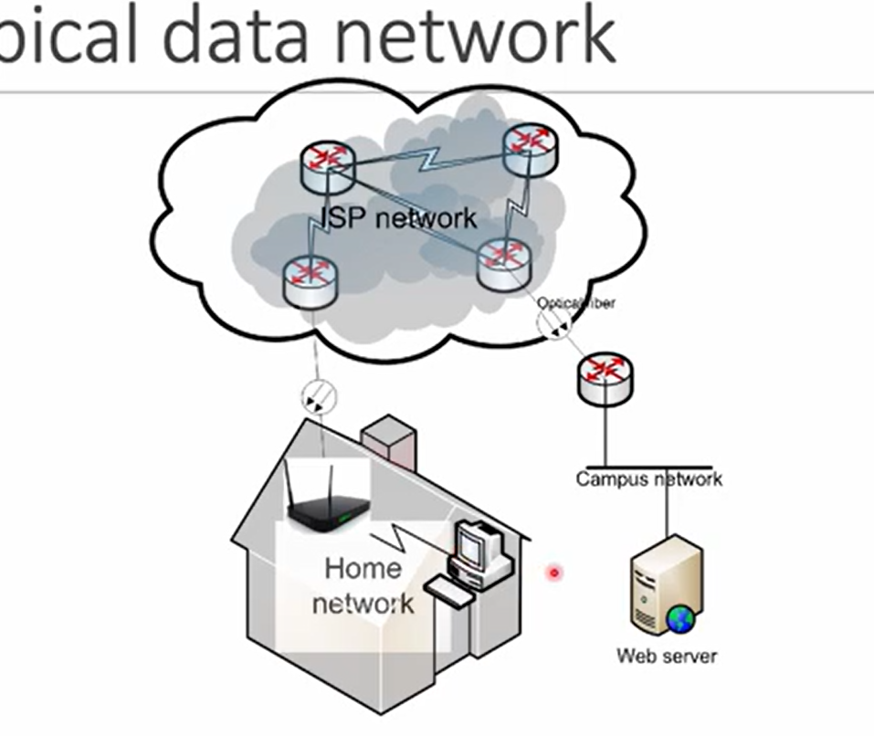
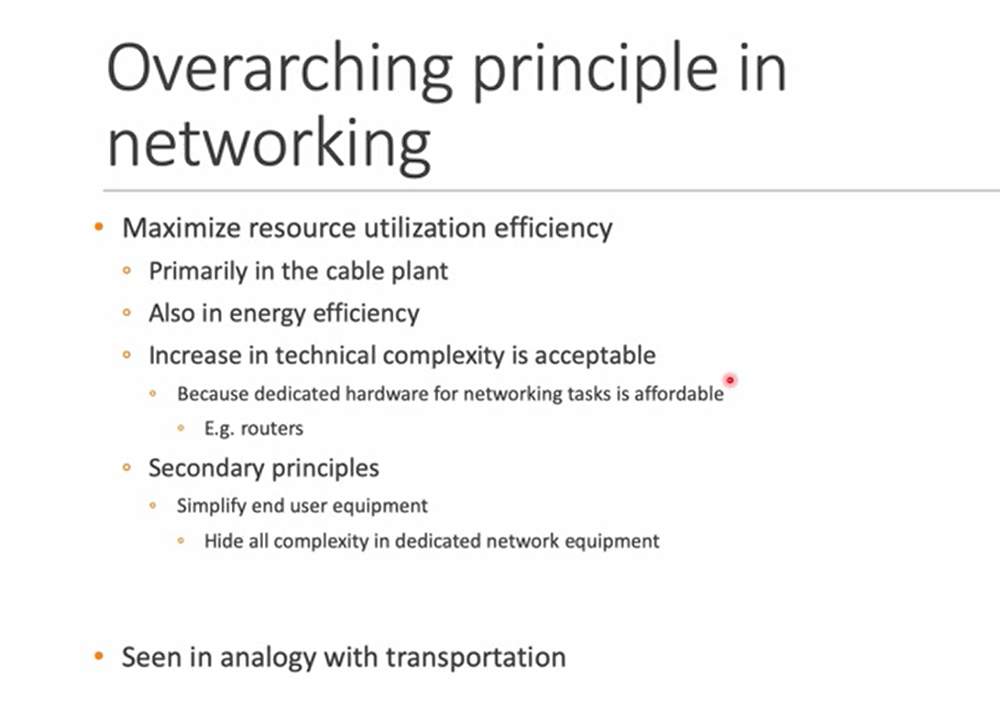
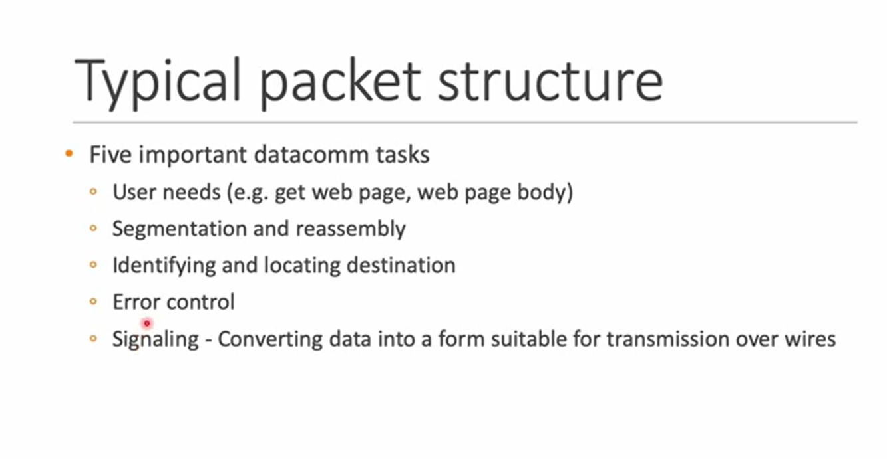
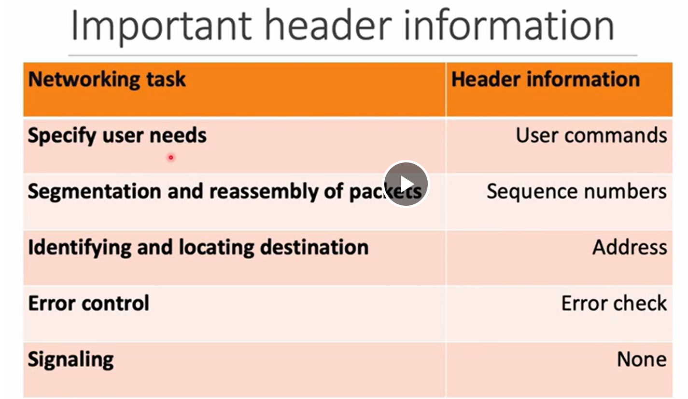
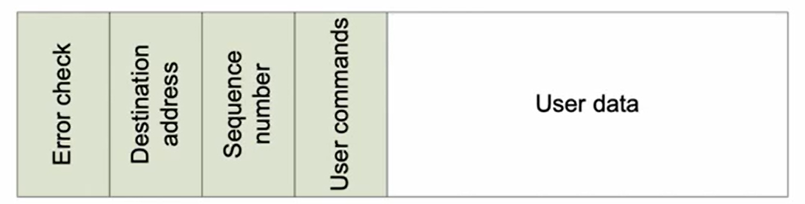
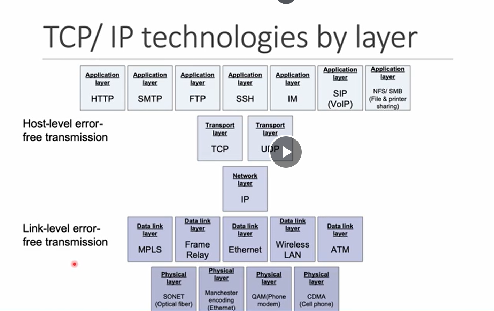
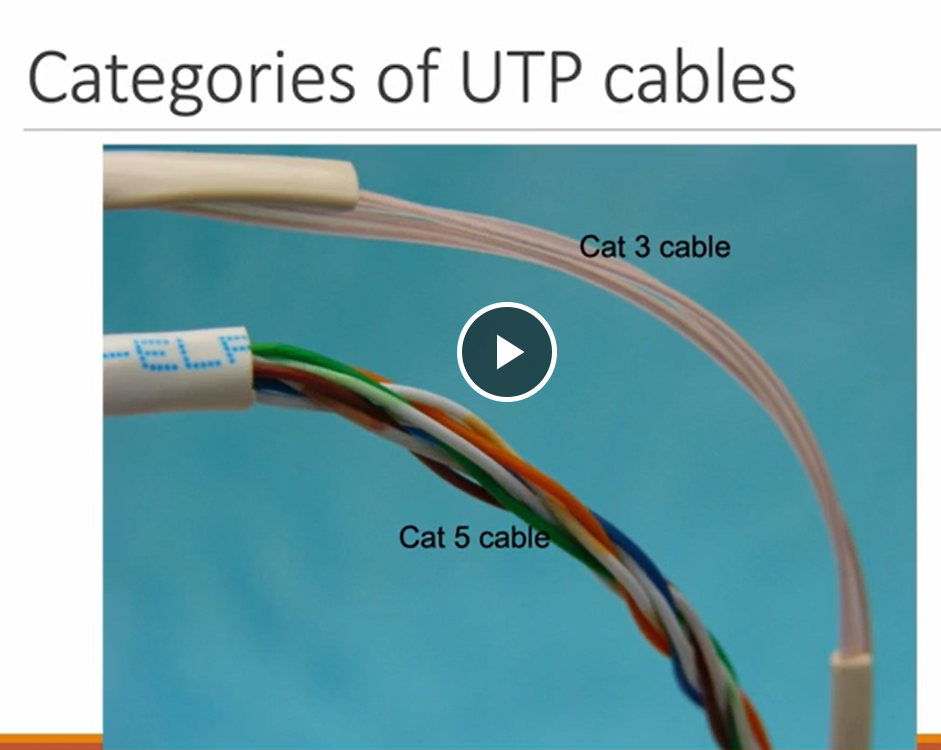
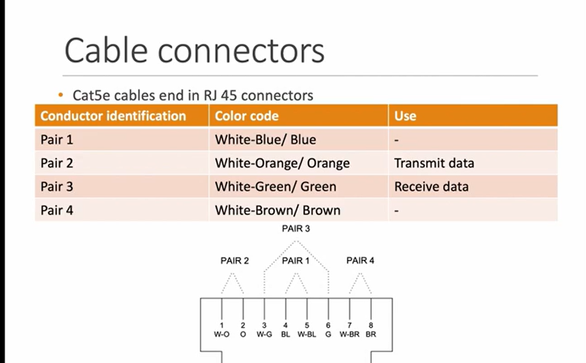

ISP : Internet Service provider 

**Purpose of Networking**

**Packetization**
* Breaking down user data into small packets.
* packaging these segment such that they can reassembled across the network.
* Each packet contains two parts 
1.  Data  
2.  Overhead required (Metadata) for sucessful delivery and intergration. 

**Advatange of Packetization**
1. Network remains consistant even though different user have different usage pattern like some scrolling twitter and someone watching 4k youtube videos.
2. In case of failure router can manage delivery of packages by themselves without inverventation of support from source/receiver.

Packet Structure

->->->->->->->->->->  
Flow

**Physical Layer**
UTP (Unshielded Twisted Pair) : pairs of insulated copper wires twisted together to reduce electromagnetic interference (EMI) from external sources and crosstalk between the pairs.

**Data Link Layer**

>Ethernet  \
>good fit for 100 meter area \
>Brodcasting every message in the cable then receiver decide to pick it or not.

**Network Layer**

